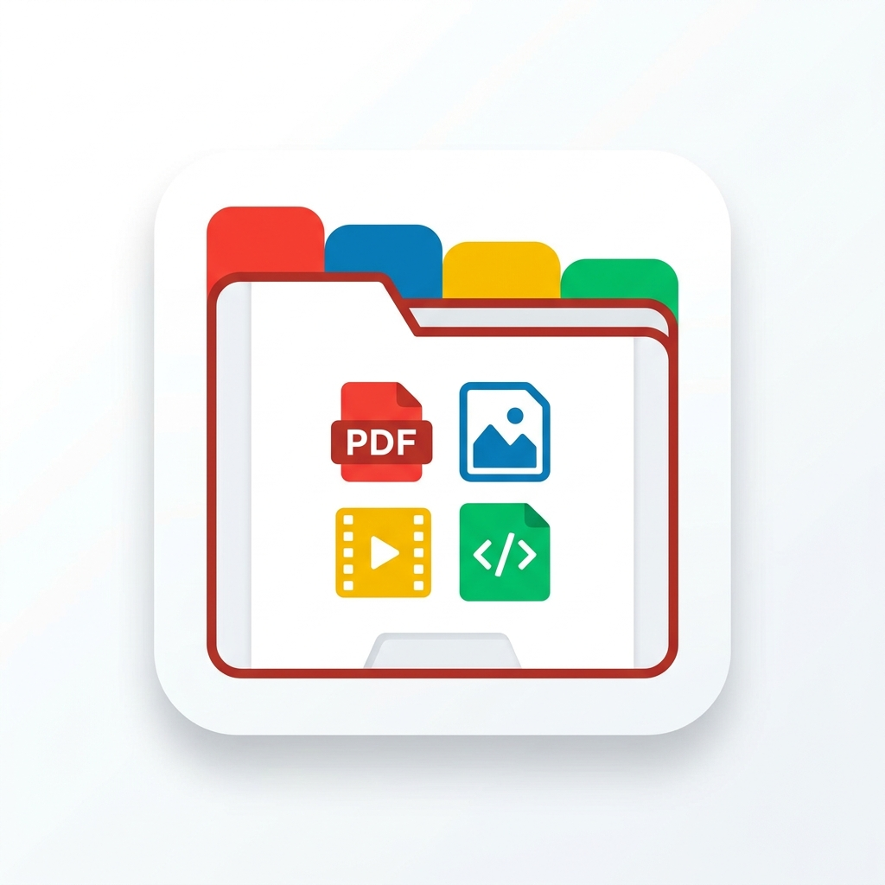
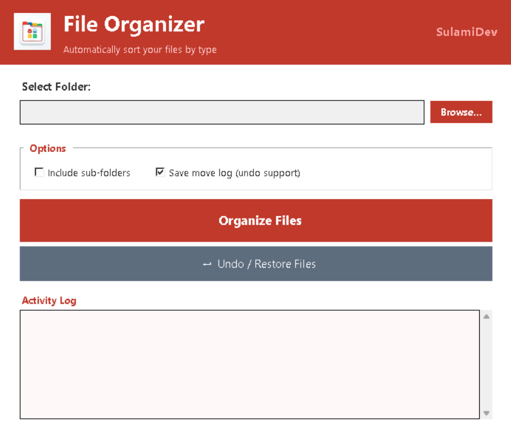
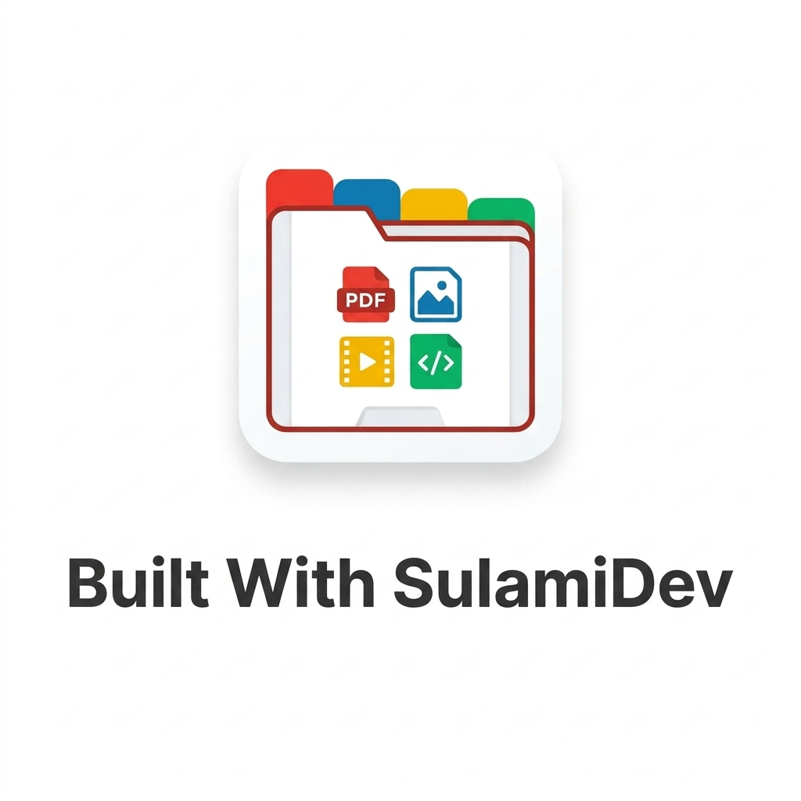

# File Organizer

<p align="center">
  
</p>

---

## About

File Organizer is a desktop tool built with Python and Tkinter.  
It moves files in a selected folder into sub-folders based on file type.

---

## How to Run

```bash
python main.py
```

---

## App Preview

<p align="center">
  
</p>

---

## Features

- Select any folder with one click
- Confirmation dialog before organizing
- Files sorted into categorized sub-folders
- Separate folders for Word, PDF, Excel, PowerPoint
- Code files sorted by language (Python, C++, Web, Java)
- Activity log shows results in real time
- Undo / Restore — moves files back to their original location
- Saves organizer_log.txt for undo support
- Handles duplicate file names automatically

---

## Folder Structure Created

```
Selected Folder/
│
├── Documents/
│   ├── Word/        ← .doc  .docx  .odt  .rtf
│   ├── PDF/         ← .pdf
│   ├── Excel/       ← .xls  .xlsx  .csv
│   ├── PowerPoint/  ← .ppt  .pptx
│   └── Text/        ← .txt  .log  .md
│
├── Code/
│   ├── Python/      ← .py  .pyw  .pyi
│   ├── C++/         ← .cpp  .c  .h  .hpp
│   ├── Web/         ← .html  .css  .js  .ts  .jsx  .vue
│   ├── Java/        ← .java  .jar
│   ├── C#/          ← .cs
│   ├── PHP/         ← .php
│   └── Other Code/  ← .rb  .go  .rs  .sql  .json  .yaml
│
├── Images/          ← .jpg  .jpeg  .png  .gif  .bmp  .heic  .psd
├── Movies/          ← .mp4  .mkv  .avi  .mov  .wmv
├── Music/           ← .mp3  .wav  .flac  .aac  .ogg
├── Archives/        ← .zip  .rar  .7z  .tar  .gz
├── Programs/        ← .exe  .msi  .bat  .cmd
└── Others/          ← everything else
```

---

## Project Structure

```
Automation/
├── main.py        ← Entry point
├── ui.py          ← Tkinter UI
├── organizer.py   ← Logic
└── images/
    ├── logo.jpg
    ├── logo_branded.jpg
    └── 1.png
```

---

## Built With

- Python 3
- Tkinter

---

<p align="center">
  
</p>

<p align="center">
  Made by SulamiDev
</p>
